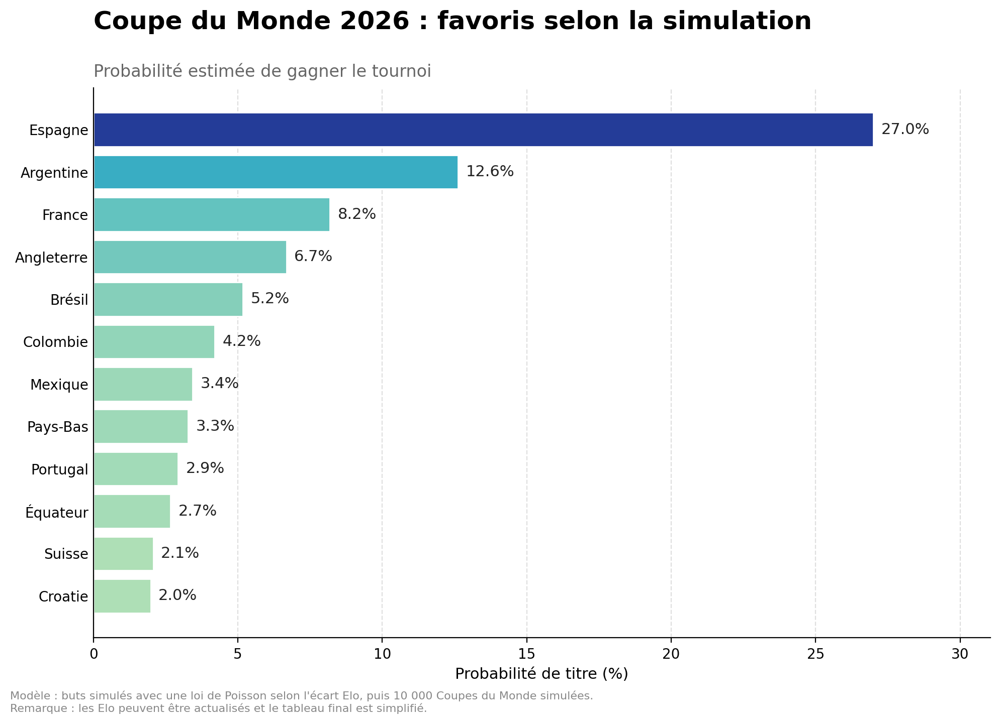
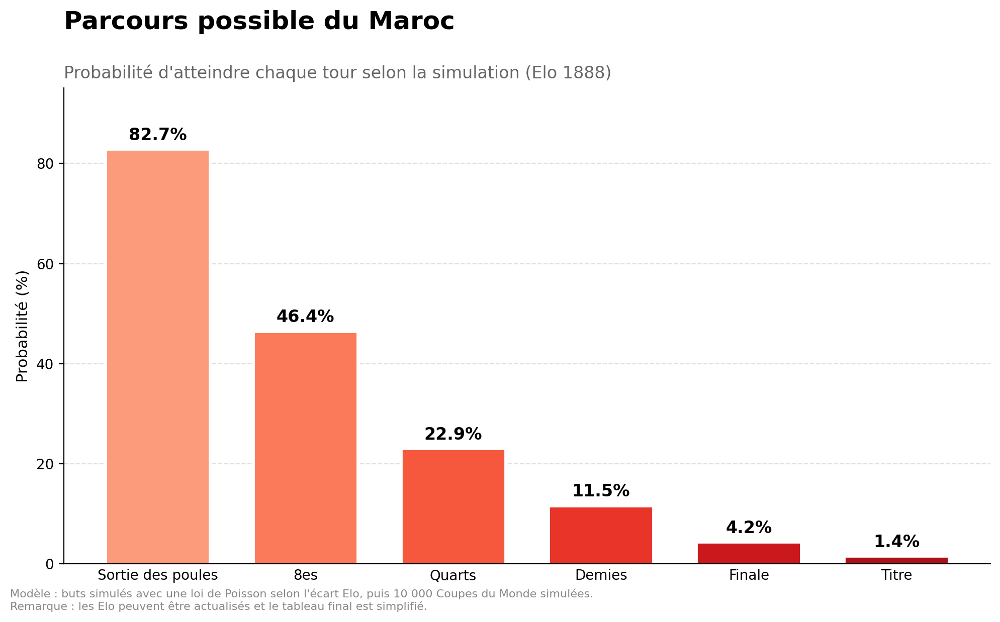

# ⚽ Simulateur — Coupe du Monde 2026

Un petit projet personnel : simuler la Coupe du Monde 2026 des milliers de fois
pour estimer les chances de chaque équipe, à partir d'un **modèle de Poisson**
et d'une **simulation Monte-Carlo**.

## Aperçu





## Comment ça marche

Le modèle repose sur trois idées simples :

1. **Force des équipes** — chaque sélection est représentée par son classement
   **Elo** (source : eloratings.net).
2. **Buts attendus** — un **modèle de Poisson** transforme l'écart d'Elo entre
   deux équipes en nombre de buts probable pour chacune.
3. **Simulation Monte-Carlo** — on rejoue l'intégralité du tournoi (phase de
   groupes + phase finale) **10 000 fois**. La fréquence à laquelle chaque
   équipe l'emporte donne sa probabilité estimée.

## Lancer le projet

```bash
pip install -r requirements.txt
python coupe_du_monde_2026.py
```

Le script affiche le classement des favoris et le parcours du Maroc dans le
terminal, puis enregistre les deux graphiques en PNG à côté du script.

## Exemple de résultats

| Équipe     | Probabilité de remporter le titre |
|------------|:---------------------------------:|
| Espagne    | ~27 %                             |
| Argentine  | ~13 %                             |
| France     | ~8 %                              |
| Angleterre | ~7 %                              |
| Brésil     | ~5 %                              |

## Limites (en toute honnêteté)

- Les Elo des meilleures équipes sont réels (janvier 2026) ; ceux de certaines
  équipes plus faibles sont **estimés** — à remplacer par les valeurs exactes
  pour gagner en précision.
- Le **tableau de la phase finale est simplifié** (ce n'est pas le tableau
  officiel exact des barrages).
- Le paramètre de sensibilité du modèle est calibré « à la main » plutôt
  qu'estimé sur des données historiques.

Bref, c'est un projet pour s'amuser et apprendre — pas un outil de pari.

## Méthode & sources

- Classements Elo : [eloratings.net](https://www.eloratings.net) (World Football Elo Ratings)
- Approche : régression de Poisson + simulation Monte-Carlo

## Stack

Python · NumPy · Matplotlib

## Licence

Distribué sous licence MIT — voir le fichier [LICENSE](LICENSE).
